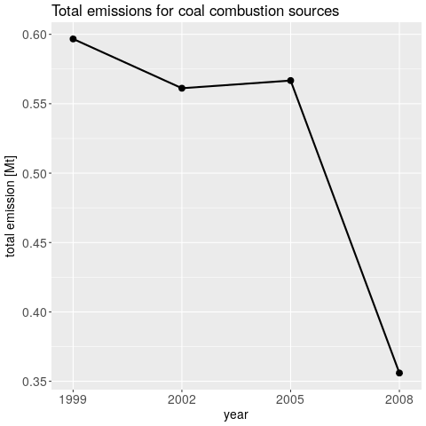
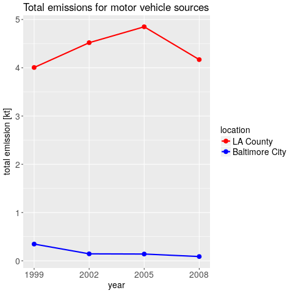

## Course project for Exploratory Data Analysis on coursera
### A. Windisch, andreas.windisch@yahoo.com

## 1. Description
In this course project we have to conduct an exploratory data analysis (EDA) on [this](https://d396qusza40orc.cloudfront.net/exdata%2Fdata%2FNEI_data.zip)
data set for air quality fine particular matter PM2.5 across the US for the years 1999, 2002, 2005 and 2008.
Make sure to unpack the zip file in the working directory and change the working directory paths in the R scripts accordingly.

## Question 1: Have total emissions from PM2.5 decreased in the United States from 1999 to 2008? 
This question is addressed in the script plot1.R. It produces a png file called plot1.png. The script depends upon the script load_data.R.
Here is the plot that it produces.   

   
   

## Question 2: Have total emissions from PM2.5 decreased in Baltimore City from 1999 to 2008? 
This question is addressed in the script plot2.R. It produces a png file called plot2.png. The script depends upon the script load_data.R.
Here is the plot that it produces.   

   
   

## Question 3: Which of the four sources of PM2.5 have decreased in Baltimore City from 1999 to 2008? 
This question is addressed in the script plot3.R. It produces a png file called plot3.png. The script depends upon the script load_data.R.
Here is the plot that it produces.   

   
   

## Question 4: Have total emissions from coal combustion sources decreased in the United States from 1999 to 2008? 
This question is addressed in the script plot4.R. It produces a png file called plot4.png. The script depends upon the script load_data.R.
Here is the plot that it produces.   

   
   

## Question 5: Have total emissions from motor vehicle sources decreased in Baltimore City from 1999 to 2008? 
This question is addressed in the script plot5.R. It produces a png file called plot5.png. The script depends upon the script load_data.R.
Here is the plot that it produces.   

   
   

## Question 6: Have total emissions from motor vehicle sources decreased in the Baltimore City and LA County from 1999 to 2008? 
This question is addressed in the script plot6.R. It produces a png file called plot6.png. The script depends upon the script load_data.R.   
Here is the plot that it produces.   

   
   

